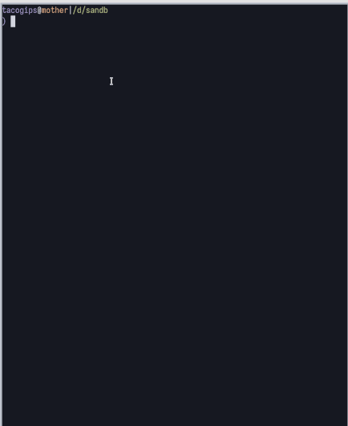
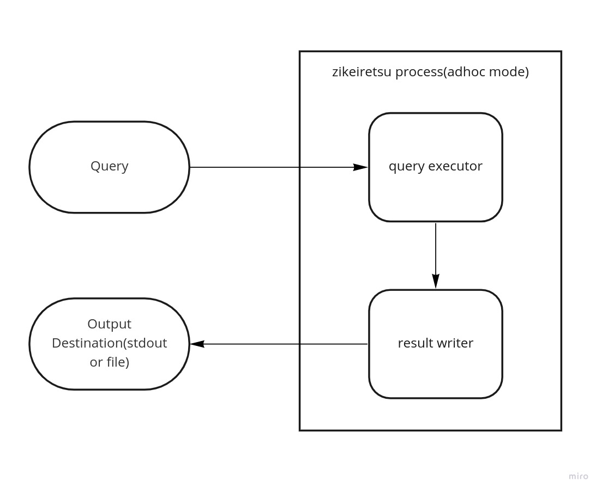
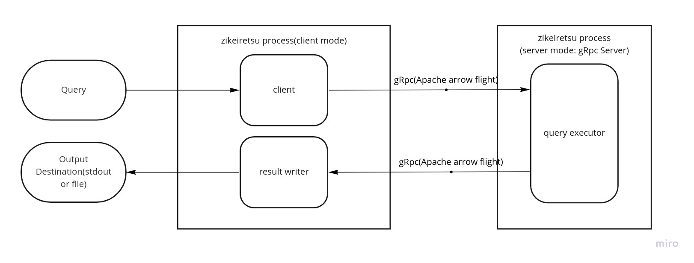

## zikeiretsu-rs
A toy time series DB



## Features
- Nanoseconds accuracy timestamps
- Multiple values in a datapoint
- Sync with Cloud storage(only Google Cloud Storge yet)

## Install
### cargo install
```
cargo install --git https://github.com/tacogips/zikeiretsu-rs --tag 0.0.1 zikeiretsu
```

## Usage

```
zikeiretsu 0.0.1

USAGE:
    zikeiretsu [OPTIONS] [QUERY]

ARGS:
    <QUERY>

OPTIONS:
    -c, --config <CONFIG>
            config file path for server and client. Read ~/.config/zikeiretsu/config.toml by default
            if it exists.

    -d, --data_dir <DATA_DIR>
            [env: ZDB_DIR=]

        --databases <DATABASES>
            config for server. pass pair of database name and the bucket name join by '=' or just
            database name.the value be separated by comma if pass multiple setting. e.g.
            databases=test_db_name=gs://test_bucket,test_db2,test_db3=gs://aaaa/bbb/cccc [env:
            ZDB_DATABASES=]

    -h, --help
            Print help information

        --host <HOST>
            config for server and client.

        --https
            config for server and client.

    -m, --mode <MODE>
            running mode {adhoc,server,client}. default: adhoc

        --port <PORT>
            config for server and client.

        --service_account <SERVICE_ACCOUNT_FILE_PATH>
            config for server. path to google service account file [env: ZDB_SERVICE_ACCOUNT=]

    -V, --version
            Print version information
```


### How to pass the parameters
You can pass the parameters zikeiretsu DB via following methods

- Config file
- Arguments
- Environment variable

### Config file example
Zikeiretsu will read config file at `~/.config/zikeiretsu/config.toml` by default.

```toml
data_dir = "/tmp/db_dir"
service_account_file_path= "/path/to/service_account"
https = false
host = "localhost"
port = 1234

[[databases]]
database_name="test_db"
cloud_storage_url ="gs://some/where"
```

### REPL
you can run your query in REPL console, if you run zikeiretsu command withot 'QUERY' parameter.
The query should end with semicolon.

```sh
zikeiretsu

query> select * from youse_metrics where ts = today();


+-------------------------------+-------+---------+--------+
| 0                             | 1     | 2       | 3      |
+-------------------------------+-------+---------+--------+
| 2022-04-26T00:00:00.321241268 | true  | 4991166 | 0.5    |
| 2022-04-26T00:00:00.321241268 | true  | 4999024 | 0      |
...
| 2022-04-26T00:00:01.978377215 | true  | 4998506 | 0.34   |
+-------------------------------+-------+---------+--------+

```


### Running Modes

Zikeiretsu run on  3 modes, adhoc/client/server.

```sh
# Run adhoc mode (default)
zikeiretsu

# Run server mode
zikeiretsu --mode server

# Run client mode
zikeiretsu --mode client
```

#### Adhoc mode


#### Client/Server mode
The server will standup as [Apache Arrow Flight](https://arrow.apache.org/docs/format/Flight.html) server.
We can call `DoGet` method with the query as the `Ticket` to get the result, from other `Arrow Flight` client such as python, julia.




### Query Example
#### full setting
```
with
  // specify metadatas in with clause, unlike conventinal SQL.
  // all definitions belows are optional

  cols       = [is_buy, volume, price],  // column alias


  force_sync_cloud = false,              // be sure to download block_list from the cloud storage
                                         // before execute the query, even if `use_cache` flag is true. default:false

  use_cache  = true,                     //  if it turns off the query not use on memory cache when the fetching and the result won't
                                         // be stored in cache. default:true.

  format = table,                        // output format: {json, table, parquet, paruqet_snappy}. default: table,

  output_file = '/path/to/file',         // specify if write out to file instead of stdout

  format_datetime = true,                // Format timestamps to readable string. default :true

  tz = jst                               // timezone of the timestamps. abbrev or '+nn:nn' format

select
  is_buy, volume, price // specified column alias or '*'
  from your_merics      //  metrics name.

// you need a filter by timestamp.
// buildin function:{ yesterday(),today()} or following datetime formats are available.
//
// 'yyyy-MM-DD hh:mm:ss.ZZZZZZ'
// 'yyyy-MM-DD hh:mm:ss'
// 'yyyy-MM-DD hh:mm'
// 'yyyy-MM-DD'
//  you can specify the offset with it.
//
where
   ts = yesterday();

```

#### filter by date formated string and offset
```
with
  tz = jst

select
  *
  from bitflyer_spot_BTC_JPY_order_book_update

// since 2022-04-26 00:00:00+9:00 until 2022-04-26 00:02:00+9:00
// the untile datetime is exclusive.
where ts in ('2022-04-26', +2 minutes);

+-------------------------------------+-------+---------+--------+
| 0                                   | 1     | 2       | 3      |
+-------------------------------------+-------+---------+--------+
| 2022-04-26T00:00:00.321241268+09:00 | true  | 4991166 | 0.5    |
| 2022-04-26T00:00:00.321241268+09:00 | true  | 4999024 | 0      |
| 2022-04-26T00:00:00.749932623+09:00 | false | 5008243 | 0.24   |
| 2022-04-26T00:00:00.749932623+09:00 | false | 5005789 | 0      |
| 2022-04-26T00:00:00.749932623+09:00 | false | 5021784 | 0      |


```

#### show metadatas
```
select  * from .metrics;
+-----------------+
| metrics         |
+-----------------+
| your_metrics_1  |
| your_metrics_2  |
| your_metrics_3  |
+-----------------+


select  * from .block_list;
+----------------+-------------------------------+-----------+------+---------------------+---------------------+
| metrics        | updated_at                    | block_num | seq  | block_list_start    | block_list_end      |
+----------------+-------------------------------+-----------+------+---------------------+---------------------+
| your_metrics_1 | 2022-04-26 12:31:24.566431424 | 3345      | 1    | 2021-12-08 12:05:07 | 2021-12-08 13:05:06 |
| your_metrics_1 | 2022-04-26 12:31:24.566431424 | 3345      | 2    | 2021-12-08 13:05:05 | 2021-12-08 13:35:16 |
| your_metrics_1 | 2022-04-26 12:31:24.566431424 | 3345      | 3    | 2021-12-08 13:35:56 | 2021-12-08 13:36:26 |
+----------------+-------------------------------+-----------+------+---------------------+---------------------+

select  * from .describe;

+----------------+-------------------------------+-----------+---------------------+---------------------+
| metrics        | updated_at                    | block_num | from                | end                 |
+----------------+-------------------------------+-----------+---------------------+---------------------+
| your_metrics_1 | 2022-04-26 12:31:24.566431424 | 3345      | 2021-12-08 12:05:07 | 2022-04-26 12:31:24 |
| your_metrics_2 | 2022-04-26 12:32:58.449633055 | 3345      | 2021-12-08 12:05:06 | 2022-04-26 12:32:58 |
+----------------+-------------------------------+-----------+---------------------+---------------------+


```

### Write the datas
you can't write the data with query. some coding will be needed.[see here](./zikeiretsu/example/persist_to_local/src/main.rs)

```rust

#[derive(Deserialize, Debug)]
struct Trade {
    pub side: String,
    pub price: f64,
    pub size: f64,
    pub exec_date: String,
}

impl Trade {
    fn into_datapoint(self) -> DataPoint {
        let ts = DateTime::parse_from_rfc3339(&self.exec_date).unwrap();
        DataPoint {
            timestamp_nano: ts.into(),
            field_values: self.field_values(),
        }
    }

    fn field_values(&self) -> Vec<FieldValue> {
        let v = vec![
            FieldValue::Bool(self.side == "BUY"),
            FieldValue::Float64(self.price),
            FieldValue::Float64(self.size),
        ];
        v
    }
}


async fn write_datas(temp_db_dir: &PathBuf) {
    let prices: Vec<Trade> = serde_json::from_slice(PRICES_DATA).unwrap();
    let prices: Vec<DataPoint> = prices.into_iter().map(|e| e.into_datapoint()).collect();

    // field type , [buy_side == bool, price == float64, size == float64]
    let fields = vec![FieldType::Bool, FieldType::Float64, FieldType::Float64];
    let persistence = Persistence::Storage(temp_db_dir.as_path().to_path_buf(), None);

    let wr = Engine::writable_store_builder("trades".try_into().unwrap(), fields.clone())
        .persistence(persistence)
        .build();
    wr.lock().await.push_multi(prices).await.unwrap();
    // persist all datapoints
    let condition = PersistCondition::new(DatapointSearchCondition::all(), true);
    wr.lock().await.persist(condition).await.unwrap();
}

```

## About compression algorithms
[see here](./SPEC.md)


## Upcoming feature (maybe some day)

- [ ] Validations
	- [ ] Metrics
	- [ ] Number of field (mismatched number of field)
- [ ] WAL
- [ ] move data types support
- [ ] Record deduplication
- [ ] More efficient caching
- [ ] Webassembly


